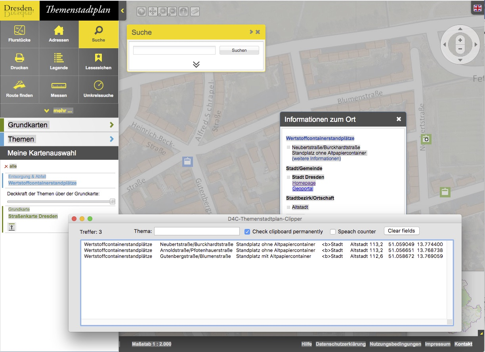

# Data4City_Themenstadtplan-Grabber
Eine Desktop-Anwendung für die Extraktion von geolokalisierten Objekten aus dem Themenstadtplan der Stadt Dresden.

Im Themenstadtplan der Stadt Dresden sind urbane Daten über eine Vielzahl von Themen verfügbar, wie z.B. die Standorte von Recycling-Containern, Ärzten, Einkaufsmöglichkeiten und vieles mehr. Zurzeit ist aber keine Schnittstelle verfügbar, um diese Daten zu extrahieren und damit in eine externe Weiterverarbeitung zu überführen. Der Themenstadtplan-Grabber ist ein Werkzeug, welche eine semi-automatische Extraktion der Daten ermöglicht.

 

Die Datei ist ein Livecode-Stackfile, d.h. sie kann mit der Livecode-IDE geladen und editiert/ausgeführt werden. 
Download der Community-Version von Livecode hier: www.livecode.org
